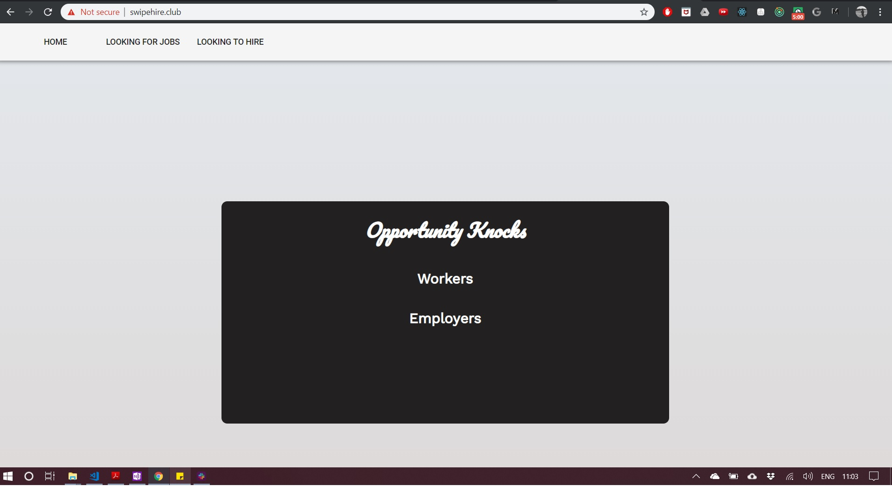
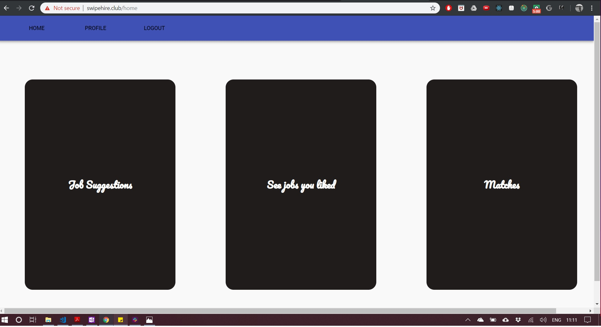
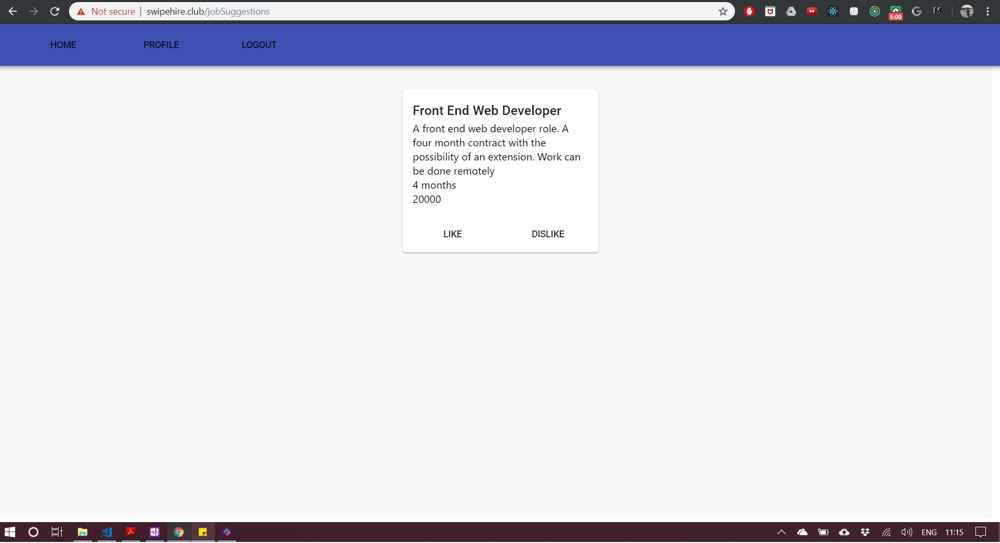
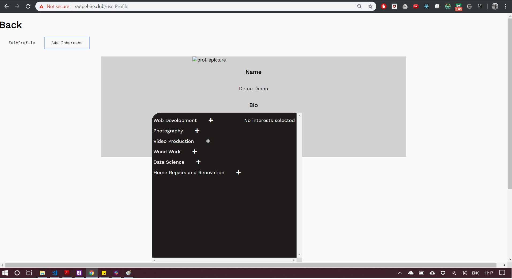
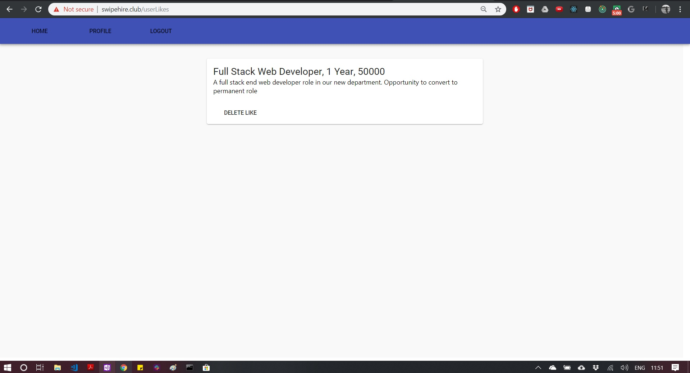
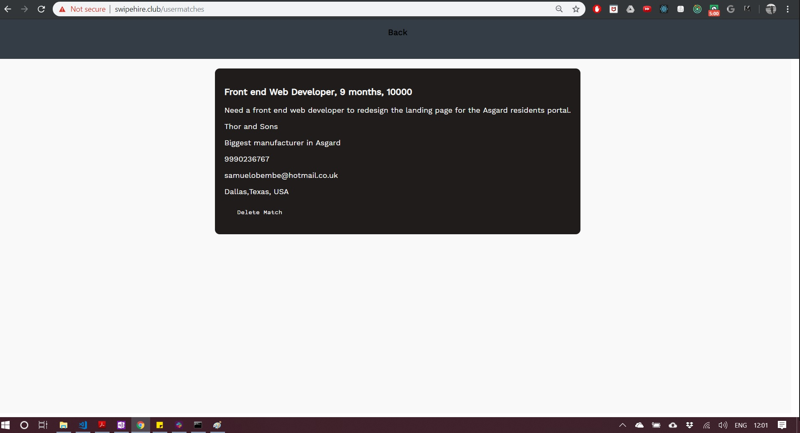

This project was bootstrapped with [Create React App](https://github.com/facebook/create-react-app).

This is a personal project, intended to be an imitation of tinder applied to job search. 

**Code comments are at the bottom of each file.** 

*This site is in the process of being rebuilt and improved.*

## Worker Login:

email : demo@demo.com
password: 123456

## Employer Login

email: demoEmployer@demo.com
password: 123456

# Landing Screen

# User Features and Navigation

1. If logging in as a user looking for work, click "Worker" on the centre tile or click "LOOKING FOR JOBS" in the navbar. Login using the demo credentials for workers.

2. After logging in as a user, the user dashboard will be shown.

    

3. Clicking on job suggestions will show job suggestions that match a user's interests. A user can like or dislike jobs. A a user has no interests, no suggestions would show. To select user interests, navigate back to the dashboard and click on "PROFILE"
    

4. In the profile page, click "Add Interests" and a pop up should be displayed . Clicking on a plus sign would add an interest. After selecting the user's interests, click "Back" to navigate to the dashboard.
    

5. From the dashboard, clicking "See jobs you liked" will navigate the user to a page showing the user's likes. From this page, a like can be deleted. 

    

6. From the dashboard, clicking "See matches" will navigate the user to a page showing the jobs a user has matched with. This shows the job details as well as the contact details of the job poster. s

    

# Employer Features and Navigation